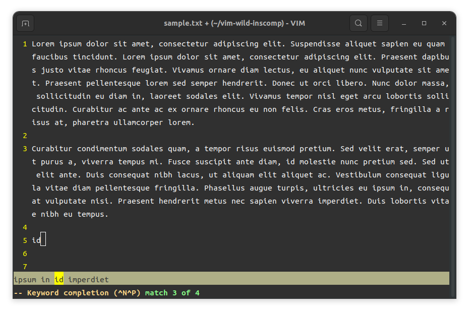

vim-wild-inscomp
================

What's this?
------------
vim-wild-inscomp lists the candidates in ins-completion on the status line. 
["wildmenu"](https://vim-jp.org/vimdoc-en/options.html#'wildmenu') option lists candidates in cmdline-completion on status line, 
but no equivalent functionality is provided in ins-completion by default. 
vim-wild-inscomp provides wildmenu-like functionality in ins-completion. 

Installation
------------
Under construction...

How to use
----------
vim-wild-inscomp displays completion candidates for comp-generic on status line.
See vim documentation for usage of [compl-generic](https://vim-jp.org/vimdoc-en/insert.html#compl-generic).

e.g. Type `i`, then press `Ctrl+N`:

License
-------
These software and configuration files may be freely used under the MIT License. See the LICENSE file for copyright information and license notice.

